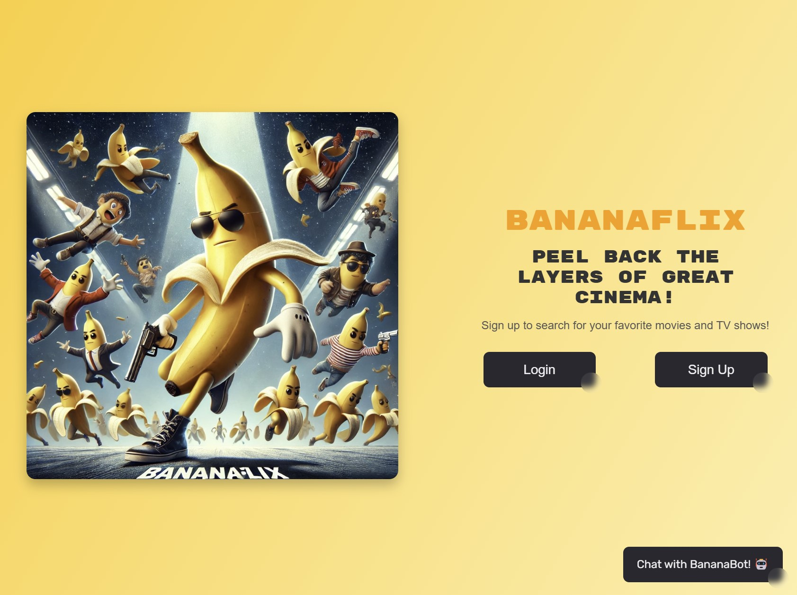
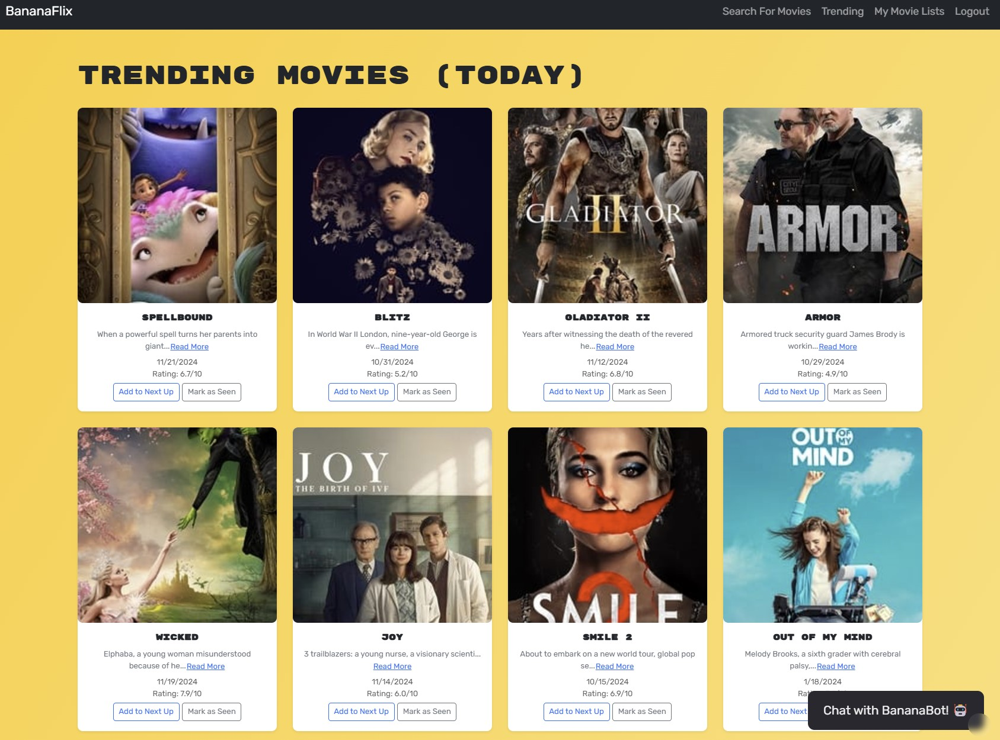
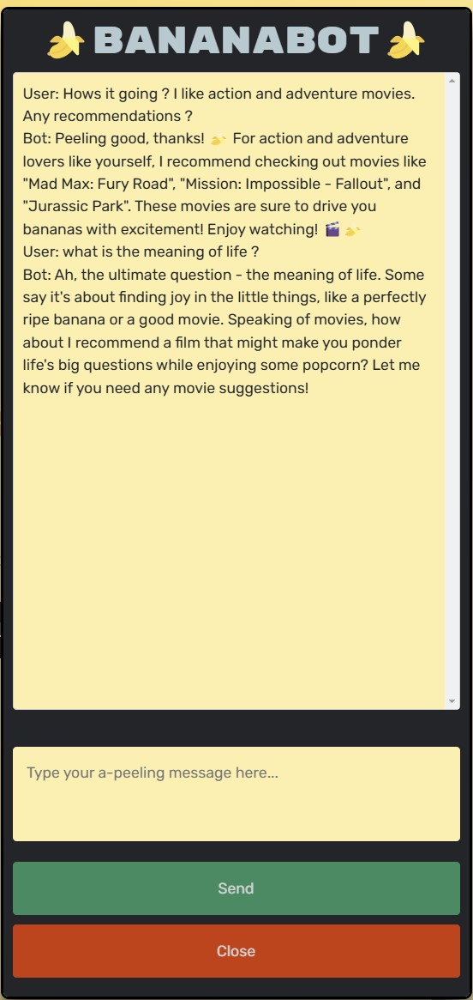

# BananaFlix
Movie Database - Project 3 
Created By: Brad Webster, Selena Garcia, Alexander Volkov and Leonardo Reis - in collaboration with edX Coding Bootcamp

## Description:
BananaFlix is a dynamic movie database platform that empowers users to discover, organize, and rate movies effortlessly. Whether you're building a watchlist of must-see films or reviewing your all-time favorites, BananaFlix is designed to make the movie experience fun, interactive, and seamless.

The platform integrates TMDB's extensive movie database with modern, user-friendly features. From a curated trending section to personalized lists for "Next Up" and "Seen It", BananaFlix provides tools to enhance your movie journey. Dive into the world of cinema with features like a chat assistant powered by AI and Apollo GraphQL for optimized performance.

## Table of Contents:
  * [Installation](#installation)
  * [Usage](#usage)
  * [License](#license)
  * [Credits](#credits)
## Installation: 
  For a live demo of this project, you can just find it here:
  https://bananaflix.onrender.com/
  <br/>The following steps will allow you to run the code locally:
  <br/>Step 0: This project requires several API keys to function properly, navigate to the following, register, and create a key:
  <br/>Step 0: TMDB Movie API: https://developer.themoviedb.org/reference/intro/getting-started
  <br/>Step 0: OPENAI API: https://openai.com/index/openai-api/
  <br/>Step 0: MongoDB: https://coding-boot-camp.github.io/full-stack/mongodb/deploy-with-render-and-mongodb-atlas (follow steps to create MONGODB_URI)
  <br/>Step 1: Navigate to : https://github.com/sashamolotovs7/BananaFlix-AI
  <br/>Step 2: Clone the repo to download it onto your local computer
  <br/>Step 3: Open download in the IDE of your choosing, navigate to the root folder
  <br/>Step 4: Navigate to 'BananaFlix/server/.env.EXAMPLE' , change file name to '.env', fill out the credentials from previous step.
  <br/>Step 5: Navigate to 'BananaFlix/client/.env.EXAMPLE' , change file name to '.env', fill out the credentials from previous step.
  <br/>Step 6: Next, navigate to the root directory "/BananaFlix", right click, run in integrated terminal
  <br/>Step 7: Run the command ```npm run set-up``` to install dependent packages, build the project, and start the program
  <br/>Step 8: Navigate to http://localhost:3000/ in your browser for a locally run website
  <br/>Step 9: Navigate to http://localhost:3001/graphql in your browser for a Apollo back end testing
  <br/>Step 10: Enjoy!

## Usage:
  Landing page displaying Login, Sign up, and BananaBot buttons
  <br/>
  <br/> User login and Sign up
  <br/>
  <br/> Trending movie section with relevent data from API
  <br/>
  <br/> Saved candidate table
  <br/>

## Features:
### Coding Language(s): 
 


<br/>Typescript, HTML, CSS, Javascript, Python
### Framework(s):
 


<br/>React, Node.js, NPM, MongoDB, Apollo-GraphQL, ChatGPT
### Other Features: 
- Personalized Movie Lists:
    - "Next Up": Save movies you're excited to watch.
    - "Seen it": Keep track of and review movies you've seen.
- Trending Movies: 
    - Explore the latest popular films with detailed information pulled from TMDB.
    - Integrated the current streaming services available for movies and tv shows
- Interactive Ratings and Reviews: 
    - Rate movies on a 10-point scale and write reviews to share your thoughts.
- BananaBot Chat Assistant: 
    - Use AI to get movie suggestions, summaries, or trivia in real time.
- Secure User Accounts:
    - Account creation with secure login/logout functionality.
    - Encrypted passwords for enhanced security.
- Intuitive Design:
    - A modern, responsive interface optimized for both desktop and mobile devices.
    - Top navigation bar for seamless access to key features.
- GraphQL API Integration: 
    - A robust backend powered by Apollo GraphQL for efficient data queries and mutations.

## License / Badges:
[](https://opensource.org/licenses/MIT) 
    
This project is licensed under the MIT license. Click the badge for more information.
## Credits:
[](https://github.com/bmw-dev0p)
Brad Webster's Github Portfolio
<br/>[](https://github.com/selmgar)
Selena Garcia's Github Portfolio
<br/>[](https://github.com/sashamolotovs7)
Alexander Volkov's Github Portfolio
<br/>[](https://github.com/Reisleo99)
Leonardo Reis's Github Portfolio
<br/>Created in collaboration with edX Coding Bootcamp
<br/>Github Badges - https://github.com/Ileriayo/markdown-badges
<br/>CSS Button Template - https://getcssscan.com/css-buttons-examples
  

